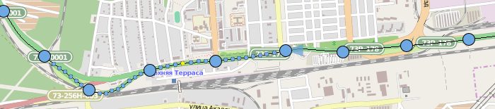

A stand-alone application for extracting frames from a dashcam video and georeferencing them
based on a GPX trace. Takes into account there could be several trace parts and a lot of videos
(maybe recorded with 10 minute intervals).

## Loading

First, a user should open all traces. Since we consider GPS time ultimately accurate, no adjustment
needed there, just glue all these traces together (with holes, but no overlaps). After loading,
traces lose their granularity and become continous lines, so we can align frames with subsecond
precision.

On the contrary, video timestamps are mostly inaccurate (that's why we need this tool). We can be
relatively sure only of relative time intervals. We load videos one by one: maybe batch mode can
be implemented later, if needed. New videos are appended at the end of last one georeferenced.

Also this tool in theory can be used to fix photo georeferencing, so it might be possible
to load photos. But this is a bit harder (we need to read EXIF, and save it so image data
is preserved), and not a priority.

## Choosing images

It's unclear whether images for saving should be chosen when opening a single video, or separately,
after loading all of them. Probably the latter. Basically the only setting is frame frequency:

* time interval between frames (e.g. 2 seconds)
* minimum distance in meters (e.g. 10 meters)
* maximum distance in meters (e.g. 50 meters)
* alternatively, distance in meters between frames (e.g. 20 meters)
* maybe different distances in relation to speed (60 kph in cities, 90kph in rural areas)

## Georeferencing

Blue dot is a video frame, big blue dot is a frame to be saved. Drag big blue dot with a mouse to
choose different adjacent frame to be saved (so you not actually "drag" a dot, but select another).
Double-click a dot to make it saved, or vice-versa.

Yellow dot is a georeferenced frame. We know its exact location (well, to an extent). Georeferencing
has subsecond precision, so when you drag a dot with a Ctrl, you make it yellow (there can be more
that one yellow dot: linear scale) and can place wherever you like. There should be an option to
prevent user from creating more than one or two referencing frames (so they have options to cancel
or replace reference points).

When you hover over a dot, its direction of view is shown. It also should be adjustable, with options:

* this frame
* from this frame to the end
* from the start to this frame
* all frames

A frame that is selected (or hovered over, needs responsiveness testing) should be displayed near
the map.

## Saving

It's simple: choose an output format (usually jpeg) and quality, and wait. Coordinates, direction
and timestamps are written in EXIF. If source is photographs, just update EXIF fields, not changing
other data.

Also allow for saving/restoring "projects": a list of files and frames with associated data. Paths
should be relative.
