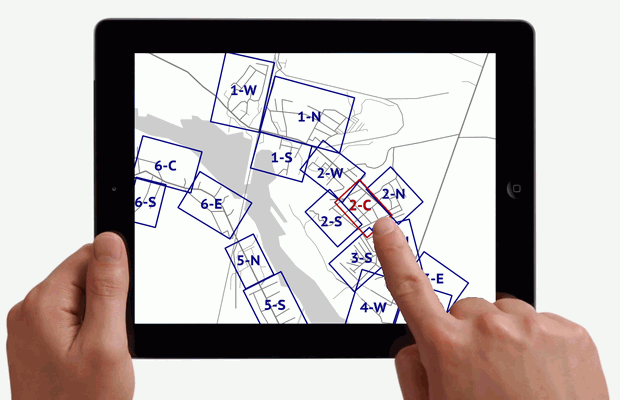

*This is a copy of [my rant](http://www.openstreetmap.org/user/Zverik/diary/26107) in OSM diary,
with slides from my presentation at SotM 2013.*

Walking papers (or field papers) are still produced from tiles. Fieldpapers.org, the "modern" service for generating atlases, is more than two years old and is a slight update to older walking-papers.org, built in 2009. It stiches tiles and produces a PDF file. You have no control over map style, you can't even use your own tiles. "Toner" style, which is the best option, are updated infrequently: you might have to wait a week before traced buildings appear on it. And some of them still won't, since it's hard to grasp how it works and why it hides some features unpredictably. Finally, pages of an atlas will be oriented by cardinal directions, in a grid with 90° angles. Of course, not many towns have such proper road network, so you will have to choose smaller scale, with less effective area for mapping.

I think I can fix this. It is easy, really: most of building blocks for a proper solution are already invented. First, an interactive map, on which you place rectangles for pages. Arbitrarily, not neccessary in a grid. Maybe draw some lines, which would be "pie segments": instead of using MS Paint for making a pie, use some advanced technology. Maybe integrate it with MapCraft. So, a bunch of rectangles on a map. Not 90°-aligned: rotate them as you like. Align with road network, with streams etc, so areas for filling in take as much space as possible, and scale is biggest you can get. When done, just save your work and close the website. Go trace some buildings and tracks.

When a morning of a mapping party comes, open the website and press "Create atlas". It will display the progress, but the atlas will be made on a server asynchronously. First, it downloads an area from OSM API. Yes, not from a local postgis database, only fresh data. An added bonus (for local installation) is that you can use cached osm data, or just bring it from another computer, if an internet connection is weak. Then it applies a MapCSS style (which you can customize, even upload some of your own or josm's) and renders each page, rotating data as needed. Then it joins pages into an atlas and provides a download link. Later the atlas can be rebuild, using fresh data, maybe a different style or with more pages.

I don't believe in scanning pages for using them as a layer in JOSM (Bing/MapBox imagery make for a better reference layer), but georeferencing marks probably can be included. That won't be the greatest feature, because I have some other thoughts. You know the weakest point of the OpenStreetMap mapping in 2014? Updating data. It is quite easy to collect and map new roads, new POIs, new restrictions. But updating it is very, very hard, almost impossible for rich regions. There are no tools. My theoretical walking papers can fix that issue. Since we have full control over data, we can put POIs and relevant tags right on pages. We have a second side: for example, on the map there would be dots with coordinates (A4, D9), and on the reverse side — tags for each dot. And the same for ways and maybe relations (didn't think it all through, obviously). So you can have not only a base map for collecting new data, but also a check list for updating the already rich map.

This solution will make mapping easier not only in third-world countries (where internet is sparse and you can't rely on external web services, or spend days installing tile rendering stacks), but in densely mapped cities, where data has not been updated for years, because it already seems well-mapped, why go there again.

